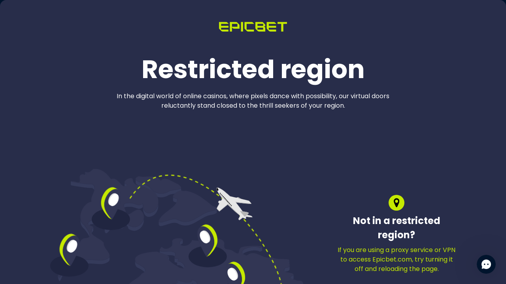

# Test Suite Overview
The test suite focuses on two key functionalities:

Search functionality based on the matches and leagues and terms that should fail to return results.

Betting functionality for the spotlight bet and the combobet.

## Tests
### 1. Fetch and Validate Matches
#### Objective
To ensure that matches displayed on the homepage can be accurately searched and validated in the search functionality.

#### Steps
- Fetch match data from the homepage using the getMatches helper function.
- Open the search modal for each fetched match.
- Input the match name into the search field.
- Validate that the search results contain relevant matches.
- Close the search modal.
#### Helpers Used
- getMatches(page, limit, logger): Fetches match terms from the homepage.
- testSearchTerm(page, term, logger): Inputs a term into the search field and validates the results.
#### Known Issues
The search functionality may fail to return results for some matches due to potential platform inconsistencies.

### 2. Fetch and Validate Leagues
#### Objective
To ensure that league names displayed on the homepage appear correctly in the search results.

#### Steps
- Fetch league names from the homepage using the getLeagues helper function.
- Open the search modal for each league name.
- Input the league name into the search field.
- Validate that the search results contain relevant leagues.
- Close the search modal.
#### Helpers Used
- getLeagues(page, limit, logger): Fetches league names from the homepage.
- testSearchTerm(page, term, logger): Inputs a term into the search field and validates the results.
#### Known Issues
Some leagues, such as NBA, Ligue 1, and La Liga, do not appear in search results. This is a known bug with the platform.
Only certain leagues, like Euroleague and Premier League, consistently pass the test.

### 3. Betting
#### Objective
To ensure that betting for spotlight match and combobet is working.

#### Steps
- Goes to the main page
- Select bet(s)
- Checks if the betting amount input comes up
- Insert the amount
- Checks if the betslip comes up
- Checks if the authentication modal comes up

### Logger
A custom logger that lets you log based on level. For example 2 is info which is meant for test environments and shows additional info that is good for testing purposes.

- error
- warn
- info
- debug
Adjust the log level in search.spec.js as needed:

#### Known issues #2
##### Platform bugs
Some leagues like NBA, Ligue 1, and La Liga do not appear in search results. This is a platform-level bug.

#### Known issues #3 

I built a CI/CD pipeline and tested it many times, but I couldn't find a workaround for the location restriction that is imposed on epicbet. See the picture below. In essence the tests should run on the pipeline if that is bypassed.

#### Additional remarks

I tested with chromium, webkit and mozilla and the increased timeouts that I have done for some tests are purely because of webkit. It rendered the page for so long I doubled the timeout. Else I think it should work. It worked best on chromium.

Please note that this is a basic test suite and does not cover all the edge cases and possibilities. It's recommended to run the tests in different browsers and environments to ensure compatibility.

